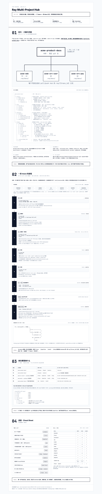

# Ray

需求驱动的 AI 开发工作流引擎，从 trace 到 ship 的全链路治理。需求进，生产级代码 + 活文档出。

## 📘 一图看懂 Ray



> 点击图片查看交互版 · [源文件](docs/blueprint/2026-04-17-ray-hub-blueprint-v3.html)

## 工作原理

需求进，生产级代码 + 活文档出。产品经理用 `/propose`，开发者用 `/trace`，两个入口共享同一条流水线。

```
propose (PM) ──┐
               ├──→ _trace-persist → pipeline → architect → qa + coder → audit → update-map → ship
trace   (Dev) ─┘                        │                      │           │
                                      guard                  learn ←─── learn
                                    (保护编辑范围)           (捕获经验，供后续迭代搜索)
```

确认后 `/pipeline` 会根据复杂度自动调度后续阶段：生成类型合约、编写测试、实现代码、质量审计、更新文档、创建 PR——全程自治。

## 安装

### Claude Code

```bash
# 1. 添加 marketplace（在终端中执行）
claude plugin marketplace add https://github.com/lenqwang/skills.git

# 2. 安装（全局，所有项目可用）
claude plugin install ray

# 或仅为当前项目安装
claude plugin install ray --scope project
```

安装后重启 Claude Code 会话生效。

### Cursor

```bash
git clone https://github.com/lenqwang/skills.git ~/.cursor/skills-ray
mkdir -p .cursor/skills && cp -r ~/.cursor/skills-ray/ray-3.1.0/skills .cursor/skills/ray
```

### Codex

```bash
git clone https://github.com/lenqwang/skills.git ~/.codex/skills-ray
mkdir -p ~/.agents/skills && ln -s ~/.codex/skills-ray/ray-3.1.0/skills ~/.agents/skills/ray
```

## Skills

### Intake — 需求入口

| Skill | 使用者 | 职责 |
|-------|--------|------|
| `/propose` | 产品经理 | 前提质疑 + 产品语言需求描述，输出含替代方案的产品简报 |
| `/trace` | 开发者 | 技术影响分析、组件级评估、治理合规双源、完整 trace |
| `_trace-persist` | 内部 | 持久化引擎（ID 生成、文件写入、CSV 索引），由 propose/trace 调用 |

### Core — 开发流水线

| Skill | 触发时机 | 职责 |
|-------|---------|------|
| `/pipeline` | trace 确认后 | 根据复杂度自适应调度后续阶段 |
| `/architect` | pipeline 调度 | OpenSpec 类型合约、不变式、FSM、故障旅程 |
| `/qa` | 合约就绪 | TDD 测试套件 + API mock，先于实现 |
| `/coder` | 测试 RED | 自愈循环 + 测试基线 + 自适应升级 + 根因分析 |
| `/audit` | 测试通过 | 置信度评分 + 证据链审计，不变式违反 = 一票否决 |
| `/update-map` | 审计通过 | 更新 MAP.md、需求追溯、产品手册、技术债 |
| `/ship` | update-map 后 | 创建 PR/MR、生成 changelog、审查就绪看板 |

### Safety — 安全与经验

| Skill | 职责 |
|-------|------|
| `/guard` | 编辑范围限制 + 危险命令拦截，pipeline worktree 模式自动激活 |
| `/learn` | 跨会话经验捕获（模式/陷阱/偏好），/audit 和 /coder 自动贡献 |

### Docs — 文档管理

| Skill | 职责 |
|-------|------|
| `/origin` | 引导活文档系统（Genesis）、校准现有文档（Reconcile） |
| `/migrate` | 产品文档迁移（--docs）、索引迁移（--index） |
| `/digest` | 归纳碎片 trace 进产品模块文件，清理过时、合并重复 |
| `/query` | 快速了解项目全貌、架构和功能模块 |
| `/post-trace` | 代码已写完后的逆向流水线：反推 trace、补测试、更新索引，全部事后执行 |

## 快速开始

```bash
# 产品经理提需求
/propose 用户希望在首页看到实时价格

# 开发者提需求（含技术分析）
/trace 用户希望在首页看到实时价格

# 确认需求后，启动流水线
/pipeline

# 流水线完成后，创建 PR
/ship

# 查看项目经验库
/learn

# 或者只想了解项目
/query
```

## 更新

Claude Code 用户可通过 marketplace 更新；Cursor/Codex 用户重新拉取 `https://github.com/lenqwang/skills.git` 后覆盖复制或更新软链即可。

## 延伸阅读

- [产品地图 · PRODUCT-MAP](docs/product/PRODUCT-MAP.md) — 全部模块的决策层索引
- [工作流详解](docs/ray-workflow/README.md) — Ray 原理、用法、复用、协作、度量
- [一图看懂 Ray](docs/blueprint/2026-04-17-ray-hub-blueprint-v3.html) — 交互版蓝图
